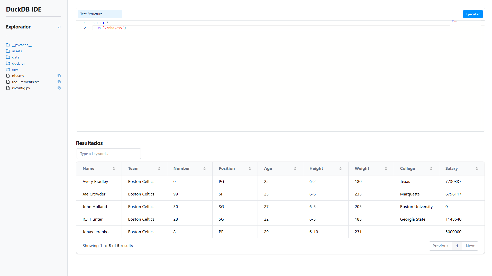

# DuckDB Reflex IDE

[](https://opensource.org/licenses/MIT)
[](https://www.python.org/)
[](https://reflex.dev/)

Un IDE de código abierto para DuckDB, construido con el framework Python **Reflex**. Diseñado para ser una alternativa potente y fácil de usar a la UI oficial, con funcionalidades avanzadas de exploración de archivos, ejecución de consultas y (próximamente) visualización de datos.



## ¿Por qué otro IDE para DuckDB?

DuckDB es una base de datos analítica increíblemente rápida y versátil. Sin embargo, las herramientas de interfaz de usuario a menudo pueden ser limitadas. Este proyecto nace con el objetivo de crear una experiencia de desarrollo similar a la de los notebooks de Databricks, pero enfocada en la simplicidad y potencia de DuckDB para el análisis de datos local.

Las metas principales son:

1.  **Mejorar la Experiencia de Usuario (UX):** Ofrecer una interfaz más intuitiva y con más funcionalidades que las herramientas estándar.
2.  **Facilitar el Trabajo con Archivos:** Integrar un explorador de archivos que no solo permita verlos, sino también interactuar con ellos para agilizar la ingesta y el análisis de datos desde CSV, Excel o Parquet.
3.  **Visualización Integrada:** Permitir la creación de gráficos y visualizaciones directamente desde los resultados de las consultas, acelerando el ciclo de análisis exploratorio.

-----

## Características Actuales

Gracias al poder de Reflex y la integración directa con DuckDB, la versión actual ya cuenta con:

  * **Editor de SQL Avanzado:** Editor de código basado en Monaco (el mismo que usa VSCode) con resaltado de sintaxis para SQL.
  * **Ejecución de Consultas en Tiempo Real:** Ejecuta tu código SQL y ve los resultados al instante.
  * **Explorador de Archivos Integrado:**
      * Navega por el sistema de archivos de tu proyecto.
      * Sube y baja entre directorios.
      * Copia la ruta relativa de cualquier archivo con un solo clic para usarla en tus consultas `(FROM 'ruta/a/mi/archivo.csv')`.
  * **Visualización de Resultados:** Muestra los resultados de tus consultas en una tabla de datos interactiva que incluye:
      * Paginación
      * Búsqueda de texto completo
      * Ordenamiento por columnas
  * **Manejo de Errores:** Muestra mensajes de error claros si tu consulta SQL falla.
  * **100% Python:** Todo el IDE, tanto el frontend como el backend, está escrito en Python usando el framework Reflex.

-----

## Roadmap (Próximas Funcionalidades) 🚀

Este proyecto está en desarrollo activo. Las próximas grandes características planeadas son:

  * 📊 **Módulo de Gráficos:** Una pestaña junto a la tabla de "Resultados" para generar gráficos (barras, líneas, dispersión, etc.) a partir de los datos del `DataFrame` resultante, similar a los notebooks de Databricks o Jupyter.
  * 📄 **Inspección de Archivos:** Al hacer clic en un archivo (CSV, Parquet, Excel) en el explorador, mostrar una vista previa de los datos, el esquema (nombres y tipos de columnas) y metadatos básicos.
  * 🌳 **Explorador de Esquema de Base de Datos:** Un panel en la barra lateral para listar las tablas, vistas y sus columnas directamente desde la instancia de DuckDB, actualizándose después de cada `CREATE TABLE`.
  * 💾 **Persistencia de Scripts:** Poder guardar y abrir archivos `.sql` directamente desde el IDE.
  * 💡 **Autocompletado de SQL:** Sugerencias inteligentes para tablas y funciones de SQL.

-----

## Instalación y Ejecución

Para ejecutar este proyecto localmente, sigue estos pasos:

1.  **Clona el repositorio:**

    ```bash
    git clone https://github.com/tu-usuario/tu-repositorio.git
    cd tu-repositorio
    ```

2.  **Crea un entorno virtual y actívalo:**

    ```bash
    python -m venv .venv
    source .venv/bin/activate  # En Windows: .venv\Scripts\activate
    ```

3.  **Instala las dependencias:**
    El proyecto necesita `reflex`, `pandas`, `duckdb` y el editor `reflex-monaco`. Crea un archivo `requirements.txt` con el siguiente contenido:

    ```txt
    reflex
    pandas
    duckdb
    reflex-monaco
    ```

    Y luego instálalo:

    ```bash
    pip install -r requirements.txt
    ```

4.  **Inicia la aplicación:**

    ```bash
    reflex init
    reflex run
    ```

5.  Abre tu navegador y ve a `http://localhost:3000`. ¡Listo para empezar a hacer consultas\!

-----

## Cómo Contribuir

¡Las contribuciones son bienvenidas\! Si quieres ayudar a mejorar este IDE, por favor sigue estos pasos:

1.  Haz un **Fork** de este repositorio.
2.  Crea una nueva rama (`git checkout -b feature/nueva-funcionalidad`).
3.  Haz tus cambios y haz **Commit** (`git commit -m 'Añade nueva funcionalidad'`).
4.  Haz **Push** a tu rama (`git push origin feature/nueva-funcionalidad`).
5.  Abre un **Pull Request**.

-----

## Licencia

Este proyecto está bajo la Licencia MIT. Consulta el archivo `LICENSE` para más detalles.